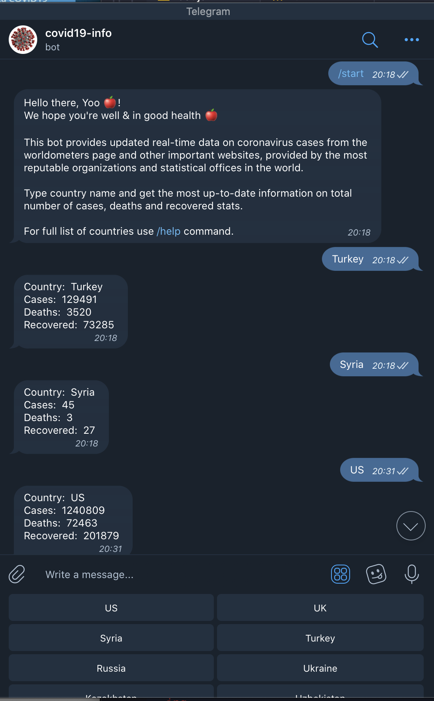

# Covid19 Telegram Bot 🤖

*This bot provides updated real-time data on coronavirus cases from the [worldometers](https://www.worldometers.info/coronavirus/) page and other important websites, provided by the most reputable organizations and statistical offices in the world.* 

Type country name and get the most up-to-date information on total number of cases, deaths and recovered stats.

 

## Tools 
* VSC [(Javascript Development Pack)](https://marketplace.visualstudio.com/items?itemName=aalpgiray.javascript-development)
* Telegram 
* [covid19-api](https://www.npmjs.com/package/covid19-api)
* [telegraf](https://www.npmjs.com/package/telegraf)
* [dotenv](https://www.npmjs.com/package/dotenv)
* NVM [(version manager for node.js)](https://github.com/nvm-sh/nvm/blob/master/README.md)
* nodemon [(monitors for any changes in your source and automatically restart your server)](https://nodemon.io/)

## Extra materials 
* [Telegram Bot API и NodeJS](https://medium.com/@vladthelittleone/telegram-api-%D0%B2-nodejs-a82b0f7ec575)
* [Creating Telegram Bot and Deploying it to Heroku](https://medium.com/python4you/creating-telegram-bot-and-deploying-it-on-heroku-471de1d96554)

## Special Thanks
A special thanks goes to [@balkoev](https://github.com/balkoev) for making a top-notch [tutorial](https://www.youtube.com/watch?v=qV_iTlufmdE&gl=US) for your further reference. Check out his [repo](https://github.com/balkoev/telegram-bot-covid19) and make sure to ⭐️ it.